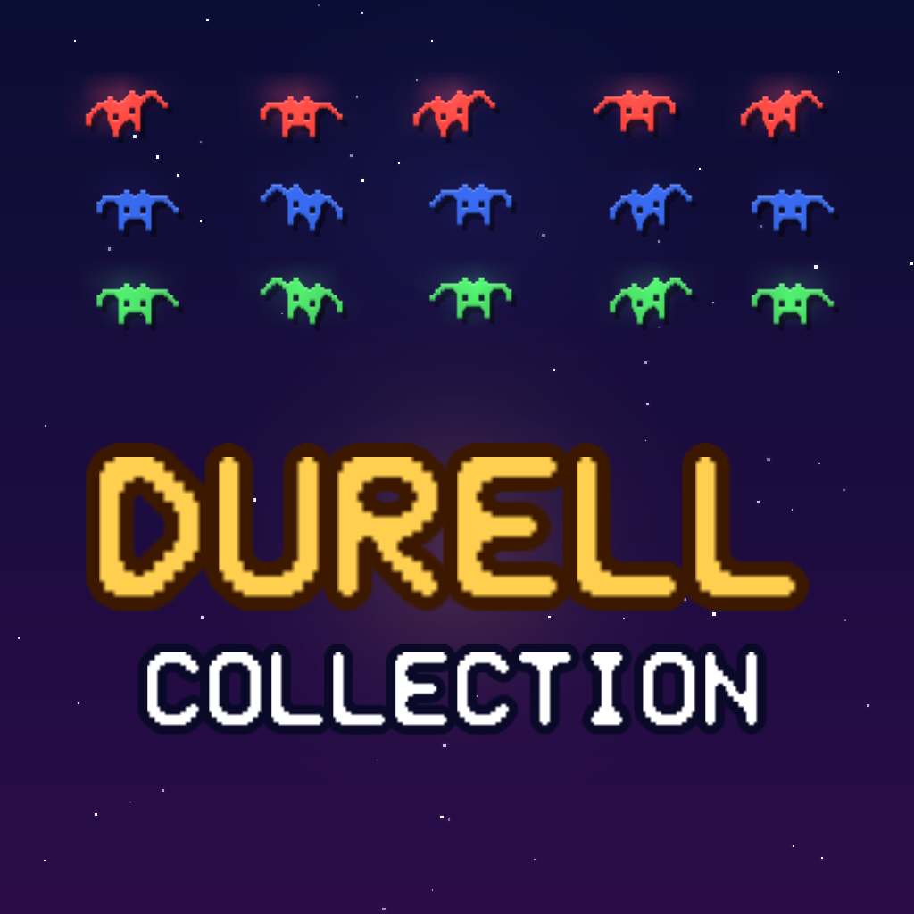

<p align="center"></p>

<h1 align="center">The Durell Collection</h1>

<p align="center"><b>Durell Software's Oric games</b>, for iOS/iPadOS, Android, macOS and Windows, made with MonoGame.</p>

| Game | Year | Author |
|---|---|---|
| Harrier Attack | 1983 | Ronald Jeffs |
| Harrier Attack 3D (the same game in 3D, new sound) | 2026 | - |
| Scuba Dive | 1983 | Ronald Jeffs |
| Star Fighter | 1983 | Mike Highfield |
| Galaxy (from Galaxy 5) | 1983 | Philip Dierks |
| Lunar Lander (from Galaxy 5) | 1983 | Robert White |
| Turbo Esprit (Oric conversion, `turbo/`) | 1986 | Mike Richardson |

Each game runs **its original program**, translated ahead of time into C# (no emulator, no
interpreter): `tools/recomp` turns the 6502 machine code into one C# method per 256-byte page, and a
small native layer stands in for the Oric's VIA, keyboard, sound chip and video chip. Lunar Lander,
the one BASIC program, is ported line by line and calls the Oric ROM's own (translated) sound
routines. Two looks, switchable at any time: **ENHANCED** and **ORIGINAL** (exactly as on the Oric).
High scores are kept between launches for every game.

**ENHANCED redraws every game in high-resolution artwork from the game's live state** (see
`docs/ARCHITECTURE.md`, "Enhanced: scenes"). Each look reads a *scene* from the game's memory after
every frame (camera, objects, animation frames) and draws it with art made in code (`Graphics/Art`,
previewed with `tools/Durell.ArtLab`), keeping only the original's score lines. Things the game
moves in whole character steps glide between steps, and where the original flips screens the camera
moves continuously instead:

| Game | Enhanced |
|---|---|
| Harrier Attack | Real sky and sea, shaded jets and ships; the land the game generates column by column is painted from its own shapes (earth, grass, guns, town) and scrolls smoothly |
| Harrier Attack 3D | The same program from a 3D chase camera: valley landscape, models, haze; loop-and-roll when turning back on the landing approach; synthesised engine, weapons, explosions and warnings (`Audio/HarrierSound.cs`) |
| Scuba Dive | One continuous underwater world - sea, shaft and the random cavern maze - with a camera that follows the diver everywhere |
| Star Fighter | Space map beyond the original's clip box with parallax stars; cockpit combat with sights and beams |
| Galaxy | Insect fleet, fighter, plasma, shield and bursts |
| Lunar Lander | Lunar module descending on its true height, flame by motor power, cratered surface, the Earth |
| Turbo Esprit | A 3D city built from the game's map (streets, buildings at its seeded heights, lamps, lights), traffic and the Lotus |

## Controls

| | Mac and Windows | iPhone, iPad and Android |
|---|---|---|
| Moving | Arrow keys (Turbo Esprit: J/L steer, S/A faster/slower) | **Tilt the device** (see below) |
| Firing | The game's own key | Touch the game picture (away from the buttons): `Controls.TapFire` |
| Other keys | The keyboard is the Oric's; KEYS on the menu / pause menu (or K) redefines any game's keys (`Input/KeyBindings.cs`, `Screens/KeysEditor.cs`, saved per game) | Buttons for the other keys (bombs, shield, map), menu keys at the top left, KEYS for a full Oric keyboard |
| Pause | Esc (or a controller's Start) | II button, Android Back |
| Look | F2 or LOOK | LOOK on the menu / pause menu |
| Volume | SOUND - / + on the menu, or the - and + keys (controller: LB / RB); click SOUND for off/on | SOUND - / + on the menu; tap SOUND for off/on |

Game controllers work on every platform. On phones and tablets **tilt is the default**:

- The way the device is held when a game starts, restarts or resumes is the neutral position.
  Tapping the TILT bubble (bottom left, where the on-screen pad would be) re-centres it.
- Tip left/right for LEFT/RIGHT; tip the top edge **away** from you for UP and **towards** you for
  DOWN. A direction engages at 9 degrees and lets go below 5 (`src/Durell.Core/Input/Tilt.cs`).
- Per game (`TiltX`, `TiltY`, `TiltPower`, `TiltHelp` in `Games/Catalog.cs`):
  Harrier Attack faster/slower and climb/descend; Scuba Dive swims; Star Fighter steers;
  Galaxy left/right only (its UP fires and SPACE is the shield); Lunar Lander maps tipping the top towards you to motor
  power 0-9 while the module flies; Turbo Esprit steers and speeds up/slows down.
- TILT on the menu or the pause menu switches it off (saved), bringing back the on-screen pad.
  It is offered only when the device has an accelerometer; no permission is needed on either OS.
- The heads supply gravity in screen axes: iOS from CoreMotion (`src/Durell.iOS/Program.cs`),
  Android from the accelerometer via SensorManager (`src/Durell.Android/MainActivity.cs`, paused
  with the activity), both rotated for the current landscape orientation.

| | |
|---|---|
| Identifiers | Apple and Android `uk.co.allthejohnsons.durellcollection`; Windows: the package identity in `signing/local.properties` (not in git) |
| Version | 1.0.0 (build 1), set in `Directory.Build.props` |

## Repository layout

```
src/Durell.Core       Shared code: Machine/ (CPU base, VIA/AY bus, video, AY synth), Games/ (translated
                      programs *.g.cs, snapshots, looks, controls, score keepers, Lunar port), Screens/, Graphics/
src/Durell.Desktop    Windows + macOS head (MonoGame DesktopGL)
src/Durell.Android    Android head (Android 12 / API 31+, targets API 37)
src/Durell.iOS        iOS/iPadOS head
tests/Durell.Tests    xUnit: long random runs of every game, high-score persistence, saves
tools/recomp          The 6502 -> C# translator and its dev tools (tape loader/snapshotter, disassembler, explorer)
tools/Durell.Runner   Headless runner (coverage, screenshots, key probes, memory peeks)
tools/Durell.Capture  Drives the real app for store screenshots and the icon
tools/*.py            Icons, store assets, store copy, support page
build/                Release script, macOS bundle files, Windows MSIX manifest and tiles
turbo/                The Oric port of Turbo Esprit (cc65 source)
```

Not in git: `originals/` (tapes, ROMs, snapshots, coverage logs), `releases/`, `stores/`, `artifacts/`, `signing/`,
and **nothing taken from the original games**: the translated programs (`*.g.cs`), the snapshots the app embeds
(`*.snap`, `turbo.disk`) and Lunar Lander's BASIC port are generated locally from your own tapes and ROMs
(`tools/recomp/make_games.sh`, see `docs/BUILDING.md`). The games remain the property of their copyright holders.

## Quick start

```bash
dotnet run --project src/Durell.Desktop     # play on Mac/Windows
dotnet run --project src/Durell.Desktop -- --no-sound   # start muted (saved setting unchanged)
dotnet test tests/Durell.Tests              # tests
build/build-release.sh all                  # release packages -> releases/
```

See [docs/ARCHITECTURE.md](docs/ARCHITECTURE.md) and [docs/BUILDING.md](docs/BUILDING.md).

## Licence

Collection code by Paul F. Johnson, released under the DILLIGAF licence (see `turbo/LICENSE`). The
games, their graphics and music remain the property of their copyright holders (Durell Software).
